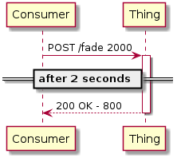

# Hypermedia Control on the Web of Things

This proposal introduces a generic hypermedia control framework for the Web of Things (WoT) that is similar to that of @vcharpenay but uses static TDs and focuses on action affordances. 
The ideas were introduced also [at this comment](https://github.com/w3c/wot-thing-description/issues/302#issuecomment-627500213)

TL;DR:

- introduce new operation types `queryaction`, `updateaction`, `cancelaction`
<!-- - introduce new fields `cancellation`, `update` to action affordances -->

## Simple Action Example According to the Current Standard

The following interface allows Consumers to invoke a `fade` action of a Lamp where the Lamp's brightness fades to a certain value with constant speed that is based on its current brightness and the provided duration by the Consumer. 
For the remainder, we assume the current brightness to be 1000 Lumens and that the brightness fades with 100 Lumens per second.

```
POST /fade
```
Here is a sequence diagram for the interaction:




```json
{
  "@context": "https://www.w3.org/2019/wot/td/v1",
  "id": "urn:ex:thing",
  "actions": {
    "fade": {
      "input": {
        "type": "number",
        "description": "duration in ms"
      },
      "output":{
        "type":"number",
        "description": "brightness value after fade operation"
      },
      "forms": [
        {
          "href": "/fade",
          "op": "invokeaction",
          "htv:methodName": "POST"
        }
      ]
    }
  }
}
```

Note that this TD is respecting the current standard. 
Currently, the output would be expected as the response to the `POST /fade` request.

## Hypermedia Use Case Example

Differently, we want an interface that allows Consumers to invoke a `fade` action of the Lamp Thing that can be additionally queried, updated or cancelled.
The meaning of these are:

- Querying: Getting information about how the action is ongoing. In our case, it **can** be the current brightness value; status message like `"pending"`, `"ongoing"`, `"finished"` or something else.
- Updating: For an ongoing or pending action, the Consumer change the desired outcome. In our case, it could be adding time or changing the total time. We can also imagine changing the fade speed etc.
- Cancelling: For an ongoing or pending action, the Consumer cancel the action. This can be before the action has started or when it is just about to start and can thus require a response to explain the current state.

We can thus imagine the following interface for the Consumer

```
POST /fade
GET /fade/{id}
PUT /fade/{id}
DELETE /fade/{id}
```

Here is a sequence diagram summarizing possible interactions **that does not show the responses of the Thing**:


With the current TD specification, a standard-compliant Consumer would be able to perform the first request but no subsequent request on the created resource (i.e. `/fade/1`). 
Also, a subsequent `GET /fade/1` would return a 404 error.

First, we want to **start** by describing that such requests can be sent to the Thing by adding new operations.


Initially, we have the following TD that is consumed by the Consumer:

```json
{
  "@context": "https://www.w3.org/2019/wot/td/v1",
  "id": "urn:ex:thing",
  "actions": {
    "fade": {
      "input": {
        "type": "number",
        "description": "duration in ms"
      },
      "output":{
        "type":"number",
        "description": "brightness value after fade operation"
      },
      "forms": [
        {
          "href": "/fade",
          "op": "invokeaction",
          "htv:methodName": "POST"
        },
        {
          "href": "/fade/{id}",
          "op": "queryaction",
          "htv:methodName": "GET"
        },
        {
          "href": "/fade/{id}",
          "op": "updateaction",
          "htv:methodName": "PUT"
        },
        {
          "href": "/fade/{id}",
          "op": "cancelaction",
          "htv:methodName": "DELETE"
        },
      ]
    }
  }
}
```
**Observations:**

This way, the Consumer does not know how to get the `id` that is a URI parameter. However, if we have a Thing that allows only a single Consumer to interact, the id can be static. An example for this is at the end of this document.

Also, it is not clear how the request payload for `updateaction` should be. It can be different than the `invokeaction` payload, i.e. `input`.

Additionally, does `output` correspond to the response of the first `POST` request?

TODO: Actual proposal

## Example Thing with Static Hypermedia

Below is an example that is for an existing device where we just change its TD.

We have a Pan and Tilt module where one can mount a camera. It is already implemented with node-wot and its source and TD are available at [wotify.org](https://wotify.org/library/Pan-Tilt%20HAT/general). We can bring it to Plugfests very easily since it is very portable.
A distilled version of its TD is below:
```json
{
  "title":"PanTilt",
  "description":"A Pan and Tilt platform on top of a Raspberry Pi",
  "properties":{
    "panPosition":{
      "readOnly":true,
      "description":"The current position of the pan platform in degrees",
      "unit":"degrees",
      "type":"number",
      "minimum":-90,
      "maximum":90,
      "forms":[
        {
          "href":"http://example.org/PanTilt/properties/panPosition",
          "contentType":"application/json",
          "op":"readproperty",
          "htv:methodName":"GET"
        }
      ]
    }
  },
  "actions":{
    "panContinuously":{
      "description":"Moves the pan platform with speed given in input until a stop action is invoked or limits are reached",
      "input":{
        "description":"The speed at which the platform moves. Negative values for right and positive values for left",
        "unit":"degree/sec",
        "type":"number",
        "minimum":-15,
        "maximum":15
      },
      "forms":[
        {
          "href":"http://example.org/PanTilt/actions/panContinuously",
          "contentType":"application/json",
          "op":"invokeaction",
          "htv:methodName":"POST"
        }
      ]
    },
    "stopMovement":{
      "description":"Stops any movement that was created with continuous movement calls",
      "forms":[
        {
          "href":"http://example.org/PanTilt/actions/stopMovement",
          "contentType":"application/json",
          "op":"invokeaction",
          "htv:methodName":"POST"
        }
      ]
    }
  }
}
```

We can reduce this TD to a single action when we think of hypermedia control.

```json
{
  "title":"PanTilt",
  "description":"A Pan and Tilt platform on top of a Raspberry Pi",
  "actions":{
    "panContinuously":{
      "description":"Moves the pan platform with speed given in input until a stop action is invoked or limits are reached",
      "input":{
        "description":"The speed at which the platform moves. Negative values for right and positive values for left",
        "unit":"degree/sec",
        "type":"number",
        "minimum":-15,
        "maximum":15
      },
      "queryOutput":{
        "description":"The current position of the pan platform in degrees",
        "unit":"degrees",
        "type":"number",
        "minimum":-90,
        "maximum":90
      },
      "forms":[
        {
          "href":"http://example.org/PanTilt/actions/panContinuously",
          "contentType":"application/json",
          "op":"invokeaction",
          "htv:methodName":"POST"
        },
        {
          "href":"http://example.org/PanTilt/properties/panPosition",
          "contentType":"application/json",
          "op":"queryaction",
          "htv:methodName":"GET"
        },
        {
          "href":"http://example.org/PanTilt/actions/stopMovement",
          "contentType":"application/json",
          "op":"cancelaction",
          "htv:methodName":"POST"
        }
      ]
    }
  }
}
```